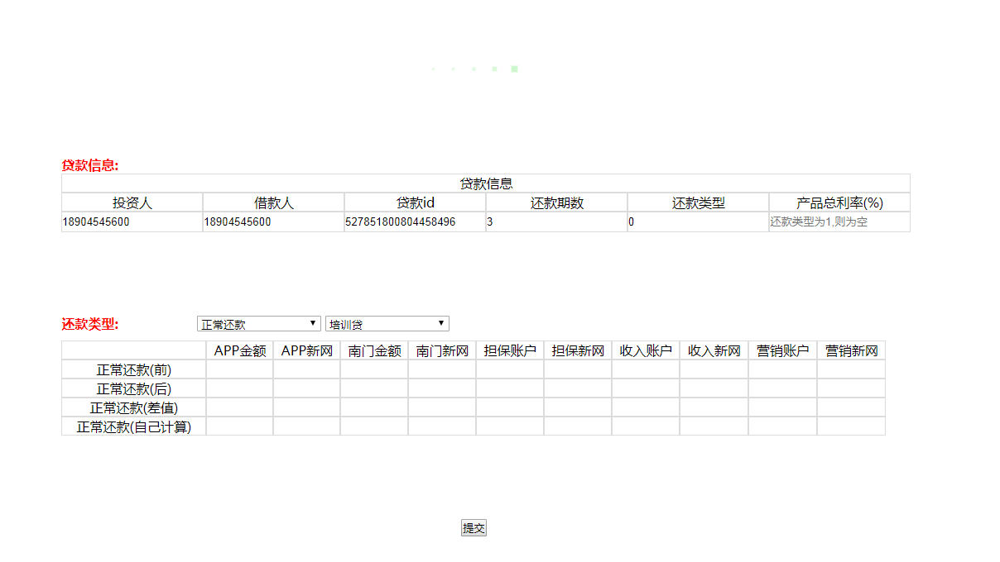

##环境: window

python 2.7.12

django 1.11.18

##目录:

jhj_rePayMents    	 进件工程

简介:该功能对每次版本回归使用

1根据页面输入的投资人账号,借款人,贷款id,还款期数,还款类型,总利率

2从输入的账号通过数据库查询到userId和accountId,获取记录到还款前的各种金额

3通过不同的还款类型和贷款类型,点击提交后,在后台通过很多接口的运行获取还款后的金额和差值,判断金额是否正常

	--config		 数据管理
		
		--id.yaml    存放账号的user,account

	--log            日志存放

	--migrations     数据迁移模块

	--public         公共方法

		--hjlcSql    理财数据库

		--md5        md5加密,登录使用

		--platformSql平台数据库

	--templates

		--index.html 还款页面

		--index.css  还款的css

	--admin			 后台管理,需要展示的字段	

	--apps           

	--id_yaml		 读取yaml文件	

	--models         创建表 

	--tests          自动化测试,可写完接口,跑接口自动化

	--urls			 url配置文件

	--views		     执行相应的代码(主要逻辑代码都在这里)

polls				 进件工程

简介:主要业务是信息录入,影像资料传送,一审,分单,二审的流程,可直接跑接口完成后面业务,为了考虑公司其他不懂代码的测试而使用django框架做了个页面,在页面输入下分单金额和贷款类型

	--migrations	数据迁移

	--templates     html

	--admin         后台管理

	--apps			

	--models		创建表

	--id_list       进件id

	--tests         自动化测试

	--views  		执行相应的代码(主要逻辑代码都在这里)

rePayMents

	--setting

	--urls

	--wsgi

static				静态的css,img等
